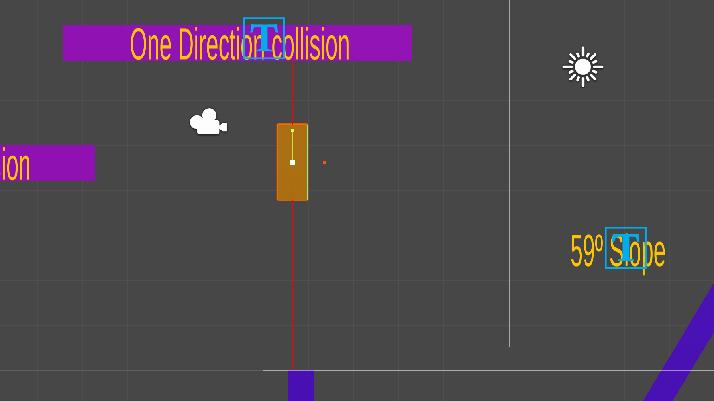
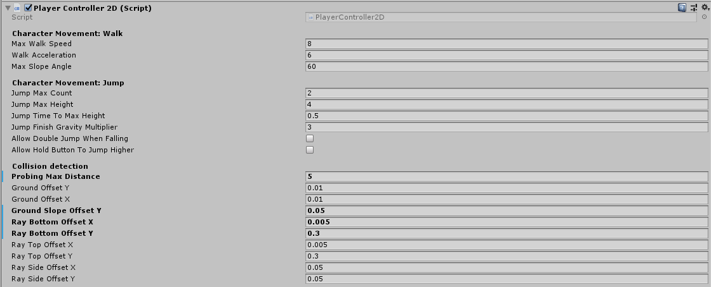
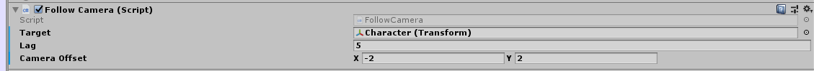

# 2D Platformer Character Controller

This is a one-week non Unity-Physics base 2D Platformer Character Controller for a Sidecroller game. What does that mean?
- No forces on rigidbodies used.
- Only colliders and raycasting.
- No overlap and repositioning.

## Scripts
### Character - PlayerController2D.cs
This script is in charge of the character movement (running, jumping and falling) and the collision detection.

These are the public variables open for a game designer to tweak and their meaning in the game.
- **maxWalkSpeed:** Maximum speed The character can walk.
- **walkAcceleration:** The character's walk acceleration.
- **maxSlopeAngle:** Maximum angle the The character can walk over.
- **jumpMaxCount:** Set the maximum number of jumps the character can perform without touching the ground.
- **jumpMaxHeight:** Maximum height the character can reach with a single jump.
- **jumpTimeToMaxHeight:** The time it takes for the character to reach the jumpMaxHeight.
- **jumpFinishGravityMultiplier:** Gravity multiplier applied to the character when apex of the jump is reached.
- **allowDoubleJumpWhenFalling:** Flag the enable/disable the double jump when falling from a higher ground.
- **allowHoldButtonToJumpHigher:** Flag the enable/disable the hold jump button. If disabled the character will reach the jumpMaxHeight no matter how long the player press the button and jumpFinishGravityMultiplier will have no effect on gravity.
- **probingMaxDistance:** Sets the maximum collision probing distance.
- **groundOffsetY:** Ground check distance offset on Y axis.
- **groundOffsetX:** Ground check distance offset on X axis.
- **groundSlopeOffsetY:** Ground check distance offset on X axis when the character is over a slope.
- **rayBottomOffsetX:** Collision probing ray launch point offset on X axis for bottom probing.
- **rayBottomOffsetY:** Collision probing ray launch point offset on Y axis for bottom probing.
- **rayTopOffsetX:** Collision probing ray launch point offset on X axis for top probing.
- **rayTopOffsetY:** Collision probing ray launch point offset on Y axis for top probing.
- **raySideOffsetX:** Collision probing ray launch point offset on X axis for sides probing.
- **raySideOffsetY:** Collision probing ray launch point offset on Y axis for sides probing.

### Platforms - OneWayPlatform.cs
This script is a component that can be applied to a platform to make it behave as one way platform that can be crossed from below.

If the Character detects a Game Object with One-way Platform component attached when checking for collisions upward it will just ignore it and pass it through.

### Camera - FollowCamera.cs
The camera implemented is a simple follow camera made for testing purporses.

These are the public variables open for a game designer to tweak and their meaning in the game.

- **target**: Target the camera fill follow.
- **lag**: Camera follow lag.
- **cameraOffset**: Camera positioning offset.
